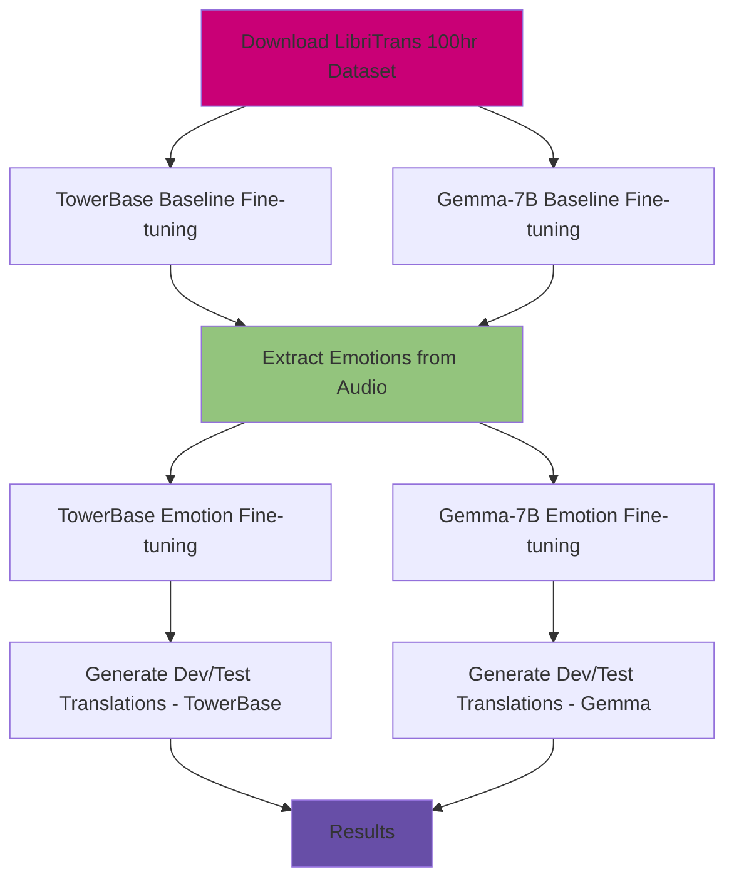

# DSL501_Project

Course Project for DSL501 Machine Learning.
Conditioning LLMs with Emotion in Neural Machine Translation


## Table of Contents
- [Project Overview](#project-overview)
- [Repository Structure](#repository-structure)
- [Project Workflow](#project-workflow)
- [Setup and Installation](#setup-and-installation)
- [Reproducibility Steps](#reproducibility-steps)
- [Results](#results)
- [Requirements](#requirements)

## Project Overview

This project explores emotion-aware speech translation by:
1. Fine-tuning baseline TowerBase and Gemma-7B models on LibriTrans 100hr dataset
2. Extracting emotional features from audio files
3. Re-training models with emotion-enhanced prompts
4. Evaluating translation quality on dev/test sets

The key innovation is incorporating emotional context (arousal and novel emotions) into the translation pipeline to produce more contextually appropriate translations.

## Repository Structure

```
.
├── data/                          # Dataset directory
│   └── (LibriTrans 100hr dataset)
├── ablation_outputs/              # Ablation study results
├── gemma_output/                  # Gemma-7B translation outputs
├── towerbase_output/              # TowerBase translation outputs
├── towerbase-7b-emotion-arousal_eq3-192/    # Fine-tuned arousal model
├── towerbase-7b-emotion-novel_prompt-192/    # Fine-tuned novel prompt model
├── towerbase_training_output/     # TowerBase training checkpoints
├── subset/                        # Dataset subset for testing
│
├── extract_emotion.py             # Audio emotion extraction script
├── translation.py                 # gemma translation script
├── translation_twb.py             # TowerBase-specific translation
├── trans_ablation.py              # Ablation experiments
├── evaluation.py                  # Evaluation phase 2
├── results.ipynb                  # Results notebook
├── dwnld_towbs.py                 # TowerBase model download
├── g_ft.py                        # Gemma fine-tuning script
├── mist7b_ft.ipynb                # Mistral-7B fine-tuning notebook
├── twbs_ft.ipynb                  # TowerBase fine-tuning notebook
├── twbs_ften_ps.py                # TowerBase fine-tuning with emotion prompts
│
├── environment_gemma.yml          # Conda environment for Gemma
├── environment_twb.yml            # Conda environment for TowerBase
├── requirements_gemma.txt         # Gemma dependencies
├── requirements_twb.txt           # TowerBase dependencies
├── .gitattributes
├── .gitignore
└── README.md
```

##  Project Workflow



### Detailed Workflow Steps:

1. **Data Preparation**
   - Download LibriTrans 100hr dataset

2. **Baseline Model Training**
   - Fine-tune TowerBase-7B on translation task
   - Fine-tune Gemma-7B on translation task
   - Save baseline model checkpoints

3. **Emotion Extraction**
   - Run `extract_emotion.py` on audio files
   - Extract arousal,valence,dominance emotion features
   - Generate emotion-enhanced prompts

4. **Emotion-Enhanced Training**
   - Fine-tune TowerBase with emotion prompts
   - Fine-tune Gemma-7B with emotion prompts
   - Save emotion-aware model checkpoints

5. **Translation Generation**
   - Generate translations for dev set
   - Generate translations for test set
   - Save outputs for both models

6. **Evaluation & Analysis**
   - Run `results.ipynb` for metric computation
   - Compare baseline vs emotion-enhanced models
   - Perform ablation studies

##  Setup and Installation

### Prerequisites
- Python 3.8+
- CUDA-capable GPU (recommended)
- Conda package manager

### Installation Steps

1. **Clone the repository**
```bash
git clone <repository-url>
cd <repository-name>
```

2. **Set up environment for TowerBase**
```bash
conda env create -f environment_twb.yml
conda activate towerbase_env
pip install -r requirements_twb.txt
```

3. **Set up environment for Gemma** (in a separate terminal)
```bash
conda env create -f environment_gemma.yml
conda activate gemma_env
pip install -r requirements_gemma.txt
```

4. **Download the dataset**
```bash
# Download LibriTrans 100hr dataset
# Place in ./data/ directory
```

##  Reproducibility Steps

### Step 1: Baseline Fine-tuning

#### TowerBase Baseline
```bash
conda activate towerbase_env
python twbs_ft.ipynb  # Or run the notebook
# OR
python dwnld_towbs.py  # Download pretrained TowerBase
```

#### Gemma Baseline
```bash
conda activate gemma_env
python g_ft.py  # Fine-tune Gemma-7B baseline set experiment=['baseline']
```

### Step 2: Extract Emotions
```bash
python extract_emotion.py 
```

### Step 3: Emotion-Enhanced Fine-tuning

#### TowerBase with Emotions
```bash
conda activate towerbase_env
python twbs_ften_ps.py #set experiments=['arousal_eq3','baseline']
```

#### Gemma with Emotions
```bash
conda activate gemma_env
python g_ft.py ['arousal_eq3','baseline']
```

### Step 4: Generate Translations

#### TowerBase Translations
```bash
python translation_twb.py 

```

#### Gemma Translations
```bash
python translation.py 
```

### Step 5: Evaluate Results
```bash
# Open and run results.ipynb
jupyter notebook results.ipynb

```

### Step 6: Ablation Studies (Optional)
```bash
python trans_ablation.py 
```

##  Results

Results are analyzed in `results.ipynb`, including:
- BLEU scores
- COMET scores
- Emotion impact analysis
- Comparison between TowerBase and Gemma models

##  Requirements

### TowerBase Environment
See `requirements_twb.txt` for full dependencies:
- transformers
- torch
- datasets
- librosa (for audio processing)
- evaluate

### Gemma Environment
See `requirements_gemma.txt` for full dependencies:
- transformers
- torch
- datasets
- librosa
- evaluate


##  Acknowledgments

- LibriTrans dataset creators
- TowerBase and Gemma model developers


---

**Note**: Ensure you have sufficient GPU memory (16GB+ recommended) for fine-tuning the 7B models.
Evaluate using BLEU, COMET, and qualitative inspection.

Visualize everything in results.ipynb.
